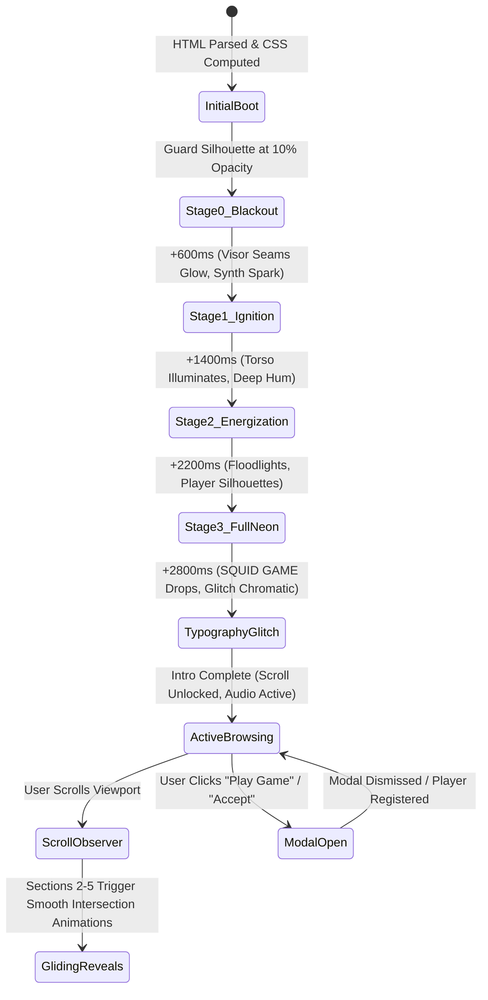

# System Architecture Document
## XTASY 4.0 / Industrial IoT Event Registration Web Experience

---

### 1. Architectural Paradigm
The project is architected as an ultra-high performance, **zero-build, client-side cinematic single-page application (SPA)**. It prioritizes instantaneous initial paint, zero runtime dependency overhead, and pure hardware-accelerated 60 FPS animations.

```
+-------------------------------------------------------------------------+
|                        BROWSER RUNTIME (Client)                         |
|                                                                         |
|  +-------------------------------------------------------------------+  |
|  |                   squid-game-landing.html                         |  |
|  |                                                                   |  |
|  |  +---------------------+  +-----------------+  +---------------+  |  |
|  |  |   HTML5 Semantic    |  |  Vanilla CSS3   |  |   ES6 Logic   |  |  |
|  |  |   Structure Layer   |  |  Engine (GPU)   |  |   Controller  |  |  |
|  |  +----------+----------+  +--------+--------+  +-------+-------+  |  |
|  |             |                      |                   |          |  |
|  |             +----------------------+-------------------+          |  |
|  |                                    |                              |  |
|  |  +---------------------------------+---------------------------+  |  |
|  |  |                     SUBSYSTEM MODULES                       |  |  |
|  |  |  1. 4-Stage Power-On Intro State Machine                    |  |  |
|  |  |  2. Web Audio API Procedural Sound FX Synthesizer           |  |  |
|  |  |  3. Ambient HTML5 Audio Stream Controller                   |  |  |
|  |  |  4. IntersectionObserver Gliding Scroll Engine             |  |  |
|  |  |  5. 3D Perspective Card Tilt & Physics Tracker              |  |  |
|  |  |  6. Dynamic Neon Glow Custom Cursor Engine                  |  |  |
|  |  |  7. Glassmorphic Modal & Form Controller                    |  |  |
|  |  +---------------------------------+---------------------------+  |  |
|  +------------------------------------+------------------------------+  |
|                                       |                                 |
|  +------------------------------------+------------------------------+  |
|  |                     LOCAL ASSET PIPELINE                          |  |
|  |  ./assets/ (11 Pre-rendered HD PNG/JPG visuals + MP3 audio)       |  |
|  +-------------------------------------------------------------------+  |
+-------------------------------------------------------------------------+
```

---

### 2. Application Flow & Lifecycle State Machine

The user experience executes across five deterministic states:



#### Detailed State Lifecycle:
1. **Bootstrapping (`DOMContentLoaded`)**:
   - AudioContext instantiated in suspended state (awaiting user gesture).
   - DOM elements indexed into memory cache to eliminate query selector thrashing.
   - Initial scroll offset reset to `top: 0`.
2. **The 4-Stage Illumination Sequence**:
   - Driven by precise CSS transition milestones and JavaScript timers.
   - Switches opacity across `hero_intro_0.png` through `hero_intro_3.png`.
   - Procedurally synthesizes high-voltage electrical sparks and low-frequency bass drops.
3. **Interactive Steady State (Active Browsing)**:
   - Body scroll operates naturally (`overflow-y: auto; scroll-behavior: smooth;`).
   - Sticky navigation dynamically applies frosted glass (`backdrop-filter: blur(16px)`) once `scrollY > 50px`.
   - Custom cursor tracks mouse coordinates with requestAnimationFrame lerping.
4. **Scroll Reveal Engine**:
   - `IntersectionObserver` with a `threshold: 0.15` monitors `.gliding-element` containers.
   - Applies hardware-accelerated transforms (`translate3d(0, 0, 0)` and `opacity: 1`) when scrolled into view.
5. **Modal Interaction**:
   - Traps focus, blurs background scene, and executes registration validation.

---

### 3. File & Directory Structure

```
xtasy/
├── squid-game-landing.html       # Primary self-contained web application
├── assets/                       # 100% locally hosted production assets
│   ├── hero_intro_0.png          # Stage 0: Guard silhouette in pure darkness
│   ├── hero_intro_1.png          # Stage 1: Red seam & visor electrical ignition
│   ├── hero_intro_2.png          # Stage 2: Neon pink suit energization
│   ├── hero_intro_3.png          # Stage 3: Full neon floodlight + player silhouettes
│   ├── invite_hand_hd.jpg        # Section 2: Black leather-gloved reaching hand
│   ├── card_cutout.png           # Section 2: 3D interactive Kraft invitation card
│   ├── pink_corridor_hd.jpg      # Section 4: Pink guard corridor gallery frame
│   ├── neon_hall_hd.jpg          # Section 4: Cyberpunk neon hallway gallery frame
│   ├── gameplay_hd.jpg           # Section 4: Contestants game arena gallery frame
│   ├── frontman_mask_hd.jpg      # Section 5: Frontman geometric faceted black mask
│   └── squid_theme.mp3           # Audio: Ambient Squid Game suspense theme
├── PRD.md                        # Product Requirements Document
├── Architecture.md               # System Architecture & Technical Flow (This File)
├── Rules.md                      # AI & Developer Boundaries and Constraints
├── Phases.md                     # Roadmap, Delivery Milestones & Progress Tracker
├── Design.md                     # Design System, Typography & Aesthetic Tokens
└── Memory.md                     # Context Memory, Architectural Log & Decision Records
```

---

### 4. Technical Stack & Engineering Specifications

| Layer | Technology | Specification / Rationale |
| :--- | :--- | :--- |
| **Structure** | Semantic HTML5 | Clean document outline (`<nav>`, `<main>`, `<section>`, `<article>`, `<footer>`). Accessible ARIA roles. |
| **Styling** | Vanilla CSS3 | Modular CSS Custom Properties (`--pink-neon`, `--cyan-neon`). Zero CSS framework dependencies. |
| **Motion** | GPU Compositing | Transitions bound strictly to `transform: translate3d()` and `opacity`. Sub-millisecond paint cost. |
| **Scripting** | Vanilla ECMAScript 2022 | Classless modular architecture, event delegation, native DOM APIs, zero polyfills required. |
| **Sound FX** | Web Audio API | Procedural sound generation via `OscillatorNode`, `BiquadFilterNode`, and `GainNode`. |
| **Score** | HTML5 Audio API | Seamless looping `.mp3` stream with programmatic volume fading and equalizer animation. |
| **Observation**| IntersectionObserver API | Decoupled scroll-driven event triggering without `window.onscroll` lag or event polling. |

---

### 5. Subsystems Architecture

#### 5.1. Audio Engine Subsystem
```
                   +------------------------------------+
                   |     User Gesture / Audio Toggle    |
                   +-----------------+------------------+
                                     |
                +--------------------+--------------------+
                |                                         |
     [HTML5 Audio Stream]                      [Web Audio API Context]
                |                                         |
    assets/squid_theme.mp3                     OscillatorNode (Sine/Square)
                |                                         |
      BiquadFilter (Lowpass)                    BiquadFilter (Bandpass/Peaking)
                |                                         |
       GainNode (Fade Ramp)                      GainNode (Attack/Decay ADSR)
                |                                         |
                +--------------------+--------------------+
                                     |
                          audioContext.destination
                                     |
                             [Stereo Speakers]
```

- **Browser Autoplay Compliance**: In accordance with modern browser security policies, audio contexts initialize in `suspended` mode until an explicit user interaction (click on sound toggle, "Play Game", or acceptance button) triggers `audioContext.resume()`.
- **Procedural Sound Design**:
  - *Power Spark*: High-frequency triangle wave (2400Hz -> 80Hz) with exponential ramp-down (duration: 180ms).
  - *Bass Boom*: Low-frequency sine wave (120Hz -> 32Hz) with resonant low-pass filter (duration: 850ms).
  - *Card Hover*: Gentle sine chirp (440Hz -> 880Hz) at 5% volume.

#### 5.2. 3D Mathematical Transform Engine
The invitation card in Section 2 (`#card3D`) computes dynamic perspective matrices on `mousemove`:
```javascript
const rect = container.getBoundingClientRect();
const x = (e.clientX - rect.left) / rect.width - 0.5;   // Normalised [-0.5, 0.5]
const y = (e.clientY - rect.top) / rect.height - 0.5;   // Normalised [-0.5, 0.5]

// Rotation limited to +/- 22 degrees for authentic tactile tilt
card.style.transform = `perspective(1000px) rotateY(${x * 44}deg) rotateX(${-y * 44}deg) translateZ(30px)`;
```

#### 5.3. Natural Continuous Scroll Engine
- **Why Slide-Lock Was Abandoned**: Slide-locked presentations ("PowerPoint style") trap user scroll velocity, causing frustration on high-refresh trackpads and mobile touch screens.
- **Implementation**: Natural browser scrolling (`overflow-y: auto; scroll-behavior: smooth;`). Smooth entrance reveals are managed via `IntersectionObserver`:
```javascript
const observer = new IntersectionObserver((entries) => {
  entries.forEach(entry => {
    if (entry.isIntersecting) {
      entry.target.classList.add('in-view');
      observer.unobserve(entry.target); // Trigger once per session
    }
  });
}, { threshold: 0.18 });
```

---

### 6. Deployment & Portability Strategy
- **Zero Build Step**: No `node_modules`, no compilation, no build step. The HTML file can be dragged into any browser (`file:///.../squid-game-landing.html`) and will render with full functionality.
- **Hosting Targets**: Completely static host agnostic:
  - GitHub Pages / Cloudflare Pages / Vercel / Netlify
  - S3 / Google Cloud Storage static website buckets
  - Self-hosted Nginx / Caddy / Apache
